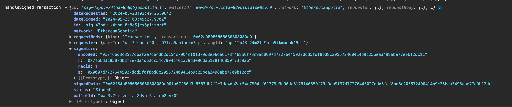
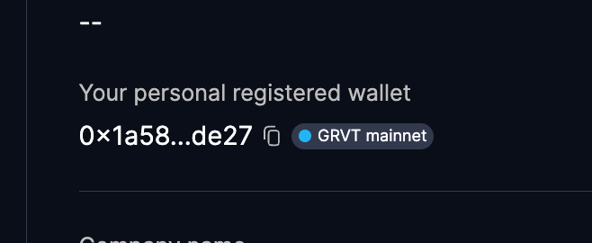

## Description
There are 2 test cases in this example
- `TestWithPrivateKey`:
  - Generate a private key, sign a message, and recover the address from the signature
  - PASSED
- `TestWithDfnsRSV`
  - Use Dfns iframe to generate R/S/V values, and recover the address from the signature
  - FAILED

Both of these test cases are using the same message and hashing/recovery scheme. This is intended to show that we couldn't recover using Dfns R/S/V values

## How to run this example
```
go mod init
go test -run ./...
```

## Error Log
With this input:
```
accountID := common.HexToAddress("0x1a58c9e1cf9ea9d878c5212c6deeb32a8d74de27")
nonce := uint32(1906624712)
```

This example with Dfns R/S/V value return the following error:

```
msgHash      : 0xbeac843b2bfb7d94b3aec759945baccca5b8b3d72c98dd05df69ba065646f510
RecoveredAddr: 0x5785044A765cCD2ce0F2dd55C9aA5E9B38fD7B71
ExpectedAddr : 0x1A58C9E1Cf9ea9D878C5212C6DeeB32a8d74DE27
--- FAIL: TestRecover (0.00s)
    recover_test.go:28:
        	Error Trace:	/Users/phamtm/code/grvt-examples/goverifier/recover_test.go:28
        	Error:      	Received unexpected error:
        	            	recovered address does not match expected address
        	Test:       	TestRecover
```

Here's the R/S/V returned from DFNS

```
{
    "id": "sig-43pdv-k4tna-8n8q5jes5plitnrt",
    "walletId": "wa-3v7sc-vccta-8dvbt6ialom8cvr0",
    "network": "EthereumSepolia",
    "requester": {
        "userId": "us-5fspc-c20sj-97lra5aoipckn3ip",
        "appId": "ap-12o43-24m2f-9nta5ikmuqhk19gf"
    },
    "requestBody": {
        "kind": "Transaction",
        "transaction": "0x02c98080808080808080c0"
    },
    "status": "Signed",
    "signature": {
        "r": "0x7f66d3c8587db2f2e7da4db2dc54c7904cf01379d3e96da6178f46850f73c9ab",
        "s": "0x0097d77276445027ddd5fdf8bd8c205572400414b9c25bea3498abe77e9b12dc",
        "recid": 1,
        "encoded": "0x7f66d3c8587db2f2e7da4db2dc54c7904cf01379d3e96da6178f46850f73c9ab0097d77276445027ddd5fdf8bd8c205572400414b9c25bea3498abe77e9b12dc1c"
    },
    "signedData": "0x02f84b8080808080808080c001a07f66d3c8587db2f2e7da4db2dc54c7904cf01379d3e96da6178f46850f73c9ab9f97d77276445027ddd5fdf8bd8c205572400414b9c25bea3498abe77e9b12dc",
    "dateRequested": "2024-05-23T03:49:25.964Z",
    "dateSigned": "2024-05-23T03:49:27.970Z"
}
```

Here's the Dfns wallet address `0x1a58c9e1cf9ea9d878c5212c6deeb32a8d74de27`

