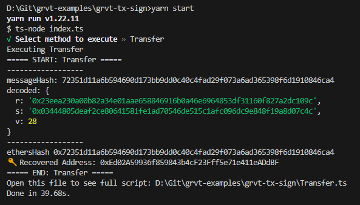

# GRVT TX SIGN EXAMPLE

## Getting Started

### Install dependencies

```bash
npm install
```

### Private key

You can find and replace the `PRIVATE_KEY` variable with your private key.

## Execute sign script

```bash
npm run start
```

## Expected output


